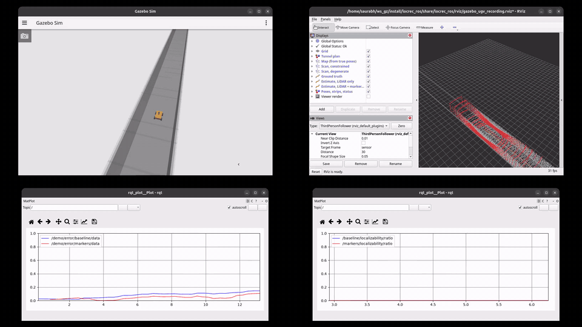
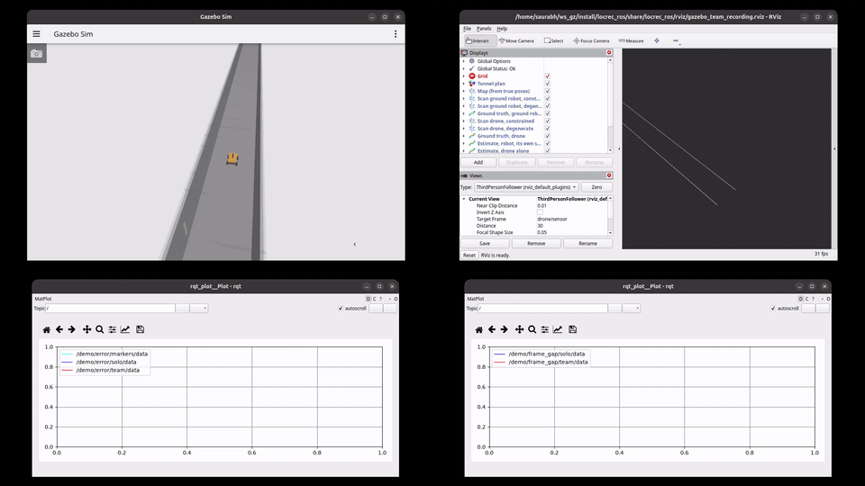
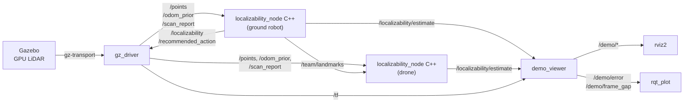

# localizability-recovery

**LiDAR localization that survives a tunnel.** Where the geometry gives out, scan matching loses a
direction and odometry slides along it. This stack detects that loss from the registration
Hessian and recovers from it: a ground robot mounts retroreflective strips on the wall exactly
where its own localization goes degenerate, and a drone following it, carrying no markers of its
own, localizes against those strips in the robot's frame.

[](https://github.com/SaurabhKhimesra/localizability-recovery/actions/workflows/ci.yml)
[](https://docs.ros.org/en/jazzy/)
[](https://gazebosim.org/docs/harmonic)
[](locrec_core)
[](LICENSE)



*Ground robot, 300 m of tunnel, sped up. Top: Gazebo and rviz, where the scan turns red where
registration goes degenerate. Bottom: live `rqt_plot` of along-track error without and with marker
fixes, and the localizability ratio each estimator publishes.*

## Results

8 seeds, 300 m of tunnel per run, every scan from Gazebo's GPU LiDAR, paired by seed with
bootstrap confidence intervals over 1000 resamples.

| | without | **with** | paired benefit |
|---|---|---|---|
| **Ground robot**, final along-track error | 2.21 m | **0.85 m** | **+1.43 m** [-0.32, +2.92] |
| **Drone**, final distance from the robot's frame | 1.85 m | **0.05 m** | **+1.78 m** [+0.73, +3.41], better on **8 of 8 seeds** |
| **Drone**, frame gap over the whole run | median 0.86 m, worst 2.61 m | **median 0.06 m, worst 0.17 m** | |

- **A 61 percent cut in drift** for the ground robot, from markers it decides to mount by itself.
- **Every seed ends within 1 to 14 cm** of the robot's frame, over 300 m, from a drone that never
  saw the robot and mounted nothing of its own.
- **The detector fires a median 5.0 s before drift takes off**, in 100 percent of 240 runs.

All of it in simulation, with the full experimental account in
[docs/RESEARCH.md](docs/RESEARCH.md).



*The team, one tunnel. Gazebo follows the robot mounting strips; rviz follows the drone 30 m
behind. Bottom: along-track error for all three estimators, and the drone's distance from the
robot's frame, alone and on the robot's strips. Full-length videos are on the
[Releases](https://github.com/SaurabhKhimesra/localizability-recovery/releases) page.*

## How it works



1. **Detect.** Each scan is registered against a local map with GICP. The translational block of
   the registration Hessian says how well each direction is constrained; the ratio of its smallest
   to largest eigenvalue, against a threshold calibrated per sensor, calls the scan degenerate.
2. **Recover.** When the robot is about to run out of constraint, the scheduler has it mount a
   strip beside itself, one step into the blind stretch, where the estimate is still trustworthy.
   Strips are found by retroreflective intensity and enter the estimator as landmarks with a
   relative formulation: a fix is weighted by the odometry since the strip went up, not by how far
   the robot is from the start of the run.
3. **Share.** The robot publishes each strip on `/team/landmarks`: its position, the 2x2
   covariance of the observation that placed it, and the face normal. No map, no trajectory. A
   drone behind it registers them as foreign landmarks and localizes in the robot's frame.

## Packages

The runtime is C++, so the estimator keeps up with the LiDAR stream. The simulation, the
visualisation and the offline study are Python, where the work is generating worlds, drawing, and
running grids across seeds.

| package | build | what it is |
|---|---|---|
| [`locrec_core`](locrec_core) | ament_cmake, C++17 | The algorithm: scan-to-map odometry, the localizability detector, the strip landmark estimator, the marker scheduler and the gaze policies. Eigen and small_gicp, no ROS dependency. |
| [`locrec_estimator`](locrec_estimator) | ament_cmake, C++17 | The node (`localizability_node`, rclcpp): message conversion, scan-to-prior pairing, the action rule, and the team's shared strips. |
| [`locrec_msgs`](locrec_msgs) | ament_cmake | `Localizability`, `ScanReport`, `MarkerObservation`, `MarkerDrop`, `SharedLandmark` |
| [`locrec_ros`](locrec_ros) | ament_python | Gazebo driver, MuJoCo publisher, `demo_viewer`, launch files, rviz layouts, and the screen recorder behind the videos. |
| [`locrec`](locrec) | ament_python | The Python library behind the offline study: `locrec/experiments/` produced the results above, `locrec/results/` holds their CSVs and the calibrated thresholds. |

## Quick start

Needs ROS 2 Jazzy, Eigen, and Gazebo Harmonic (gz-sim 8) with its Python bindings.

```bash
mkdir -p ~/ros2_ws/src && cd ~/ros2_ws/src
git clone https://github.com/SaurabhKhimesra/localizability-recovery.git
cd ~/ros2_ws
rosdep install --from-paths src --ignore-src -y
pip install mujoco small-gicp moderngl imageio imageio-ffmpeg
colcon build && source install/setup.bash
```

small_gicp has no rosdep key. The C++ build fetches the pinned release itself, or takes a local
checkout with `--cmake-args -DSMALL_GICP_SOURCE_DIR=<path>` for an offline build.

```bash
ros2 launch locrec_ros gazebo.launch.py                    # ground robot, with and without markers
ros2 launch locrec_ros gazebo.launch.py vehicle:=team      # robot mounts strips, drone 30 m behind uses them
ros2 launch locrec_ros gazebo.launch.py vehicle:=drone     # two drones, two gaze policies
ros2 launch locrec_ros demo.launch.py                      # the same stack on the MuJoCo simulator
```

Each opens Gazebo following the vehicle, and rviz. Useful arguments: `seed:=`, `length:=` in
metres, `world:=blind|mixed|junction`, and `gazebo_gui:=false rviz:=false` for headless runs.

To record the screen the way the videos above were made, with Gazebo, rviz and two live
`rqt_plot` windows tiled:

```bash
ros2 run locrec_ros record_windows.sh team 1 300 ~/team.mp4 6   # vehicle seed length output speedup
```

The node's topics and parameters are in
[locrec_estimator/README.md](locrec_estimator/README.md); the simulation and visualisation side
is in [locrec_ros/README.md](locrec_ros/README.md).

## Tests

```bash
cd ~/ros2_ws
colcon test --packages-select locrec_core locrec_estimator && colcon test-result --all

cd src/localizability-recovery
PYTEST_DISABLE_PLUGIN_AUTOLOAD=1 python -m pytest locrec/test locrec_ros/test
```

83 gtest cases over the C++ and 161 pytest cases over the Python.
[CI](.github/workflows/ci.yml) builds the workspace and runs the C++ and estimator suites on every
push; the viewer's tests want a display, so they stay local.

## Reproducing the results

One process per seed, which is what makes 8-seed statistics affordable. From the repository root,
with the workspace sourced:

```bash
python locrec/experiments/calibrate_thresholds_gazebo.py --workers 6              # per-sensor thresholds
python locrec/experiments/gazebo_crosscheck.py --platform ugv --seeds 8 --jobs 2  # ground robot, markers
python locrec/experiments/team_pass_gazebo.py --seeds 8 --jobs 2                  # the team
```

Each of these carries its declared statistic and acceptance criterion in its docstring, written
before it was first run, and writes a CSV to `locrec/results/`.

## Documentation

| | |
|---|---|
| [docs/RESEARCH.md](docs/RESEARCH.md) | the full write-up: every experiment, its declared statistic and what it found |
| [docs/DECISIONS.md](docs/DECISIONS.md) | design decisions and the reasoning behind each one |
| [docs/failures.md](docs/failures.md) | engineering log: every silent failure found, measured and fixed |
| [docs/PRIOR_ART.md](docs/PRIOR_ART.md) | related work, and where this sits against it |
| [docs/REAL_DATA.md](docs/REAL_DATA.md) | the path to a public dataset, with the tooling already in place |

## License

[MIT](LICENSE)
