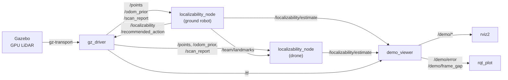

# localizability-recovery

A ROS 2 stack for LiDAR localization where the geometry gives out: long tunnels and corridors,
where scan matching loses a direction and odometry drifts along it. It detects that loss from the
registration Hessian, and recovers from it. A ground robot mounts retroreflective strips on the
wall wherever its own localization goes degenerate, and a drone that follows it, carrying no
markers of its own, localizes against those strips in the robot's frame.

ROS 2 Jazzy · Gazebo Harmonic · rviz2 · Python


*Ground robot, 300 m of tunnel in Gazebo, sped up. Top: Gazebo and rviz, where the scan turns red
where registration is degenerate. Bottom: live `rqt_plot` of |along-track error| without and with
marker fixes, and the localizability ratio each estimator publishes.*

## Results

8 seeds, 300 m of tunnel, every scan from Gazebo's GPU LiDAR, paired by seed with bootstrap
intervals. Statistics were declared before each experiment ran.

| | without | with | paired benefit |
|---|---|---|---|
| **Ground robot**, final along-track error, median | 2.21 m | **0.85 m** with markers | +1.43 m [-0.32, +2.92], better on 5 of 8 seeds |
| **Drone behind the robot**, final distance from the robot's frame, median | 1.85 m | **0.05 m** on the robot's strips | +1.78 m [+0.73, +3.41], better on **8 of 8** seeds |
| **Drone behind the robot**, gap between the two vehicles' frames over the whole run | median 0.86 m, worst 2.61 m | **median 0.06 m, worst 0.17 m** | |

What the team result is and is not: the drone agrees with the robot, it does not become more
accurate in the world than the robot was. It inherits the robot's own error, which is the floor.

The live ROS pipeline reproduces the offline pass: on seed 1 the marker estimator's final
along-track error is 1.063 m live and 1.063 m offline, mean 0.468 m against 0.467 m, 20 markers
both ([docs/failures.md](docs/failures.md) number 30). Full account, including the results that did
not hold, in [docs/RESEARCH.md](docs/RESEARCH.md).


*The team, one tunnel. Gazebo follows the robot mounting strips; rviz follows the drone 30 m
behind. Bottom: |along-track error| for all three estimators, and the drone's distance from the
robot's frame, alone and on the robot's strips. Full-length videos are on the
[Releases](https://github.com/SaurabhKhimesra/localizability-recovery/releases) page.*

## How it works



1. **Detect.** Each scan is registered against a local map (GICP). The translational block of the
   registration Hessian says how well each direction is constrained; the ratio of its smallest to
   largest eigenvalue, against a threshold calibrated per sensor, calls the scan degenerate.
2. **Recover by mounting.** When the robot is about to run out of constraint, the scheduler asks the
   driver to mount a strip beside it. Strips are detected by retroreflective intensity and enter the
   estimator as landmarks with a relative formulation: a fix is weighted by the odometry since the
   strip went up, not by how far the robot is from the start.
3. **Share.** The robot publishes each strip on `/team/landmarks`: its position, the 2x2 covariance
   of the observation that placed it, and the face normal. Nothing else. A drone following it
   registers them as foreign landmarks and localizes in the robot's frame.

## Packages

| package | build type | what it contains |
|---|---|---|
| [`locrec`](locrec) | ament_python | The algorithm: scan-to-map odometry, the localizability detector, the landmark estimator, the marker scheduler and gaze policies, and the MuJoCo and Gazebo tunnel simulators. No ROS dependency, so it is unit tested and swept offline; `locrec/experiments/` holds the experiments and `locrec/results/` their outputs and the calibrated thresholds. |
| [`locrec_msgs`](locrec_msgs) | ament_cmake | `Localizability`, `ScanReport`, `MarkerObservation`, `MarkerDrop`, `SharedLandmark` |
| [`locrec_ros`](locrec_ros) | ament_python | Nodes (`localizability_node`, `gz_driver`, `sim_publisher`, `demo_viewer`), launch files, rviz layouts, and a script that screen-records Gazebo, rviz and live plots |

## Build

Needs ROS 2 Jazzy and Gazebo Harmonic (gz-sim 8) with its Python bindings (gz-transport13,
gz-msgs10). `mujoco` and `small_gicp` have no rosdep keys and come from pip.

```bash
mkdir -p ~/ros2_ws/src && cd ~/ros2_ws/src
git clone https://github.com/SaurabhKhimesra/localizability-recovery.git
cd ~/ros2_ws
rosdep install --from-paths src --ignore-src -y
pip install mujoco small-gicp moderngl imageio imageio-ffmpeg
colcon build
source install/setup.bash
```

## Run

```bash
ros2 launch locrec_ros gazebo.launch.py                    # ground robot, with and without markers
ros2 launch locrec_ros gazebo.launch.py vehicle:=team      # robot mounts strips, drone 30 m behind uses them
ros2 launch locrec_ros gazebo.launch.py vehicle:=drone     # two drones: forward gaze against glance gaze
ros2 launch locrec_ros demo.launch.py                      # the same stack on the MuJoCo simulator
```

Each opens Gazebo following the vehicle and rviz. Useful arguments: `seed:=`, `length:=` (m),
`world:=blind|mixed|junction`, `gazebo_gui:=false rviz:=false` for headless runs.

To record the screen the way the videos above were made (Gazebo, rviz and two live `rqt_plot`
windows, tiled):

```bash
ros2 run locrec_ros record_windows.sh team 1 300 ~/team.mp4 6   # vehicle seed length output speedup
```

Nodes, topics and parameters are in [locrec_ros/README.md](locrec_ros/README.md).

## Tests

```bash
cd ~/ros2_ws/src/localizability-recovery
PYTEST_DISABLE_PLUGIN_AUTOLOAD=1 python -m pytest locrec/test locrec_ros/test
```

`PYTEST_DISABLE_PLUGIN_AUTOLOAD=1` keeps the ROS pytest plugins out: with pytest 9 they stop the
run before collection, and none of these tests needs them.

## Reproducing the numbers

The experiments run the same `locrec` code offline, one process per seed, which is what makes
8-seed statistics affordable. From the repository root, with the workspace sourced:

```bash
python locrec/experiments/calibrate_thresholds_gazebo.py --workers 6             # per-sensor thresholds
python locrec/experiments/gazebo_crosscheck.py --platform ugv --seeds 8 --jobs 2   # ground robot, markers
python locrec/experiments/team_pass_gazebo.py --seeds 8 --jobs 2                   # the team
```

The Gazebo experiments carry their declared statistic and criterion in the docstring, written
before the first run, and write their CSVs to `locrec/results/`.

## Documentation

| | |
|---|---|
| [docs/RESEARCH.md](docs/RESEARCH.md) | the full write-up: every experiment, its statistic, and what did not hold |
| [docs/DECISIONS.md](docs/DECISIONS.md) | design decisions and the reasoning behind them |
| [docs/failures.md](docs/failures.md) | 37 things that went wrong, how each was found, and the fix |
| [docs/PRIOR_ART.md](docs/PRIOR_ART.md) | related work, and what this does and does not claim |
| [docs/REAL_DATA.md](docs/REAL_DATA.md) | the next step: a public dataset, with the tooling ready |

## Limitations

Simulation only so far, in procedurally generated tunnels. Two simulators are used; where they
disagree, Gazebo is the reference and MuJoCo the faster cross-check. Looking for localizability by
turning the sensor does not pay: on Gazebo forward and glance gaze are level. The odometry's scale
filter recovers 63 per cent of the scale error and leaves 37 per cent, and what it leaves correlates
-0.965 with the final along-track error; the cause is found and not yet fixed
([docs/failures.md](docs/failures.md) number 35).

## License

[MIT](LICENSE)
