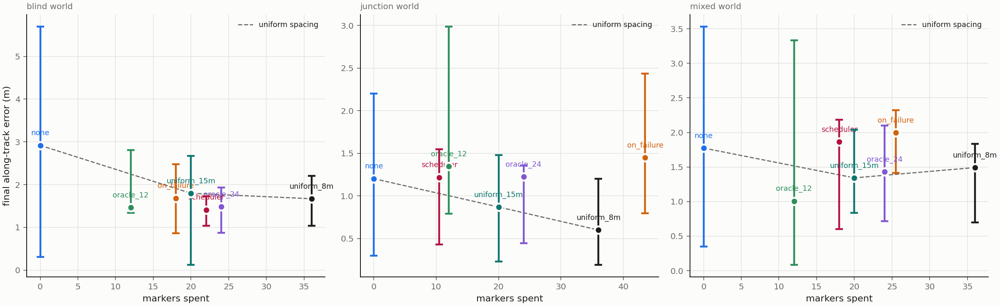
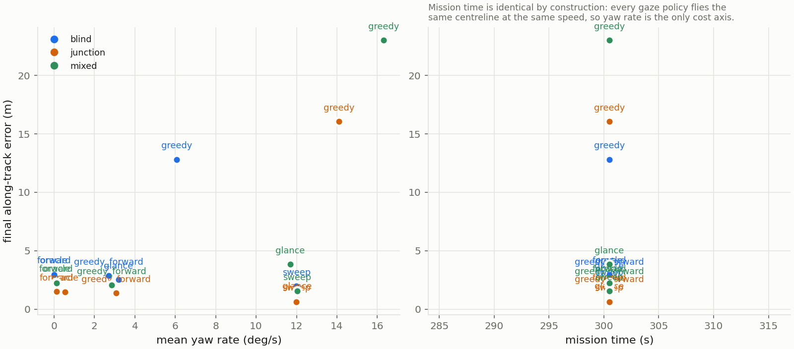
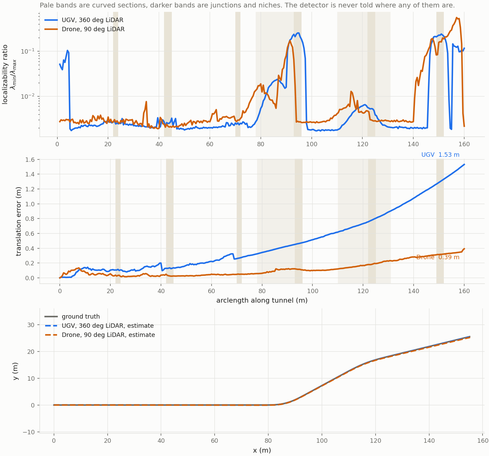
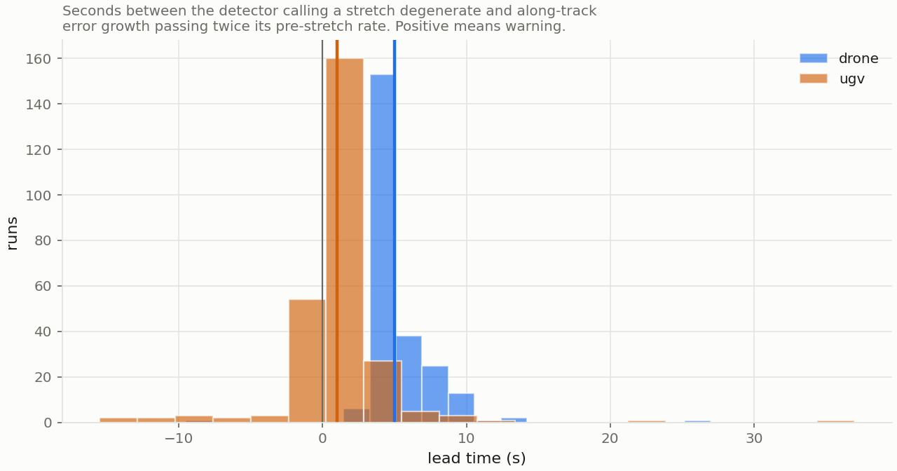
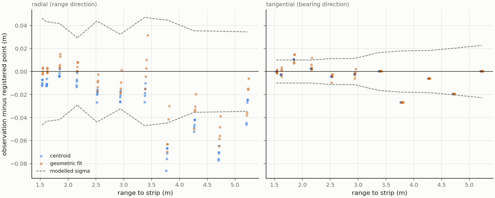
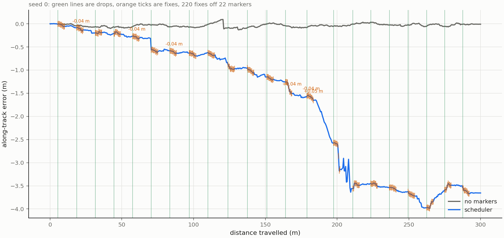
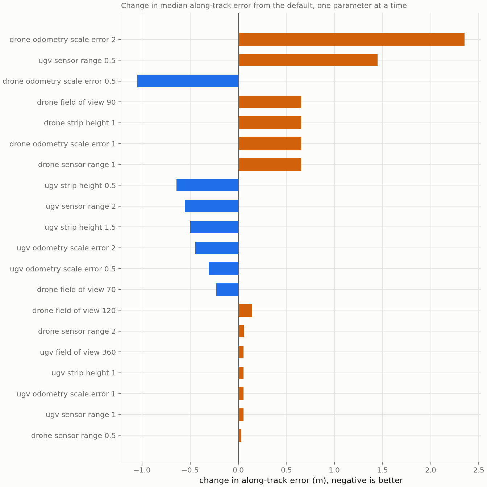

# Research write-up: localizability is a resource

The full account behind the [README](../README.md): every experiment, its declared statistic and
what it found, including the results that did not hold. Numbers are from the 8-seed passes unless
stated.

A robot in a tunnel can look for localizability, carry it, or leave it behind.
This repository tests whether scheduling those actions from the odometry Hessian
cuts drift at a small, quantified cost, over 504 Monte Carlo runs on procedural
tunnels with common random numbers.

**The detector works, and that result is unconditional.** It calls a stretch
degenerate a median **5.0 s before along-track error takes off on the drone,
positive in 100 percent of 240 runs over 789 measured stretches**, and 1.0 s in
75 percent on the UGV. It holds in every world and for every policy, and it does
not depend on what the robot then does about it.

**Carrying localizability works where the prior is bad, and nowhere else yet.** A
chain of dropped markers is a traverse: on the bench it turns a 2 percent odometry
scale error into **0.13 m over 200 m against 4.01 m of dead reckoning**, and the
estimator recovers the scale factor itself to 1.2 percent of its true value. In
full worlds at the default 2 percent it is flat: the scheduler's best paired
result is **1.47 m on a 2.92 m baseline in blind tunnel with 22 markers**, and the
interval straddles zero. At 4 percent, which is wheel odometry on loose ground or
a visual-inertial front end in dust, it separates cleanly: **4.28 m becomes 1.32 m,
paired 2.29 m, 8 of 8 seeds, interval [0.33, 5.86]**. That is the first result in
this project whose interval excludes zero, and it is reported as a sensitivity
rather than a headline because the headline condition was fixed in advance.

**Looking for localizability still does not pay.** A bounded look-back, which turns
the sensor to the best structure behind for at most three seconds and then returns
to forward, is the first Hessian-driven gaze policy to beat forward gaze at all:
paired **0.12 m on a 2.96 m baseline, 7 of 8 seeds, interval [0.04, 0.40]** in
blind tunnel. That is four percent of the error, it is flat in the junction world
and negative in the mixed one, and an oracle handed the true world does no better
than forward. Inside a forward cone, in a tunnel, there is usually nothing better
to look at than forward. That paired 0.12 m is MuJoCo's; on the reference sensor the two gaze
policies are level, 1.91 m forward against 1.89 m glance, so the conclusion stands and the one
sub-result that favoured glance does not survive the sensor that governs.

Every headline is 8 seeds with bootstrap intervals over 1000 resamples. The
50-seed pass is scripted and costs about seven hours.





Sim only. Ground truth is sim truth. No parameter is chosen after seeing a result,
thresholds are calibrated on seeds 100 to 119 which the evaluation never touches,
and every policy walks the same sampled tunnels with the same odometry errors.

**Which simulator governs.** Two are used: MuJoCo on CPU, which casts rays, and Gazebo's GPU
LiDAR, whose ranges come out of a rendered depth texture. **Where they disagree the Gazebo number
is the result and MuJoCo is the cross-check.** MuJoCo runs a 300 m pass in 30 seconds against
Gazebo's 250, so it is the right place to run a grid or a declared A/B first; it does not settle a
question the reference sensor answers differently. That rule has already changed a default: the
strip fit's bias correction is exact on MuJoCo and wrong on Gazebo, so it is off (`docs/failures.md`
number 34). Three claims have been measured on both and are marked below: the UGV's markers, the
drone's gaze, and the team. The Monte Carlo grids in this section predate the Gazebo port and have
**not** been re-run on it, so they are MuJoCo numbers and are to be read as the secondary sensor's.

## What the detector is

A scan-to-local-map registration returns a 6x6 Hessian. Its translational block is
the information the geometry supplies about position, so its eigenvalues say how
well constrained each direction is and its smallest eigenvector says which
direction is worst. The detector is the ratio of smallest to largest, calibrated
into a threshold as a quantile over calibration seeds: **1.84e-3 for the UGV and
2.83e-3 for the drone**, both from seeds 100 to 119, written to
`locrec/results/thresholds.json`. The two differ because a 90 degree 30 m scanner in a
3.2 m tunnel sees a different distribution from a 360 degree 10 m one, and using
the UGV's number on the drone leaves the gaze policies never engaging.

Nothing is told where the curves, junctions or niches are, and the ratio rises by
one to two orders of magnitude exactly where the geometry stops being a straight
tube.



| Platform | Median lead time | Positive in | Stretches measured |
|---|---|---|---|
| Drone | 5.0 s | 100 percent of runs | 789 |
| UGV | 1.0 s | 75 percent of runs | 750 |



Positive means the detector fired before along-track error growth passed twice its
pre-stretch rate, which is the only way the signal is worth anything to a planner.

Two things about that Hessian are not what they look like, and both were found by
measurement.

**Its along-track information is not real.** The calibrated Hessian claims a 4 to
5 mm standard deviation along a tunnel that has no along-track structure at all.
Rebuilding the local map from ground-truth poses, so that it is a fixed and
correct reference rather than one the estimate drags along, does not make the
drift vanish: it halves, from about 1.0 m to 0.4 m over 120 m, and what remains is
a systematic backward pull. The number is an artefact of treating a thousand
correlated correspondences as independent evidence. Translational information
below a calibrated eigenvalue ratio is discarded outright.

**Registration against a self-built map is relative, not absolute.** The map is
built from the estimate, so when the estimate slides along the tunnel the map
slides with it and the registration stays perfectly satisfied. Hence the two-stage
split: stage A is relative, a prior fused with the registration by their
information matrices, and stage B is absolute, a marker fix applied to the pose
**and rigidly to the local map and to every landmark registered since the last
fix**, excluding the anchors the fix was computed from.

## The UGV: markers, and a traverse

A wall-mounted retroreflective strip, 1.0 m by 0.15 m, sized from mine practice
rather than from a sweep.

### What a marker actually constrains

A dropped marker does not know where it is in the world. It knows where the robot
was when it went on the wall, so the constraint it supplies is relative: the
residual's covariance is the drop-time observation, plus the current observation,
plus the odometry accumulated in between. Nothing in that grows with distance from
the start of the run.

Weighting instead by the marker's absolute covariance, which is what this did
through milestone 7, says that a marker dropped 250 m into a tunnel is nearly
worthless exactly where it is the only thing available.

The prior's scale error is also a state now. It is one number per run, not a fresh
draw per step, and calling it white noise is what stopped a marker chain behaving
like a survey traverse: the filter sat at a steady-state lag behind every anchor
and the next anchor was dropped carrying it. The along-track residual over a leg of
length L is an observation of `(s - 1) L`, so one scalar Kalman step per fix
identifies it. On the bench, 200 m with a 2 percent bias and markers every 10 m:

| | Before the scale state | After |
|---|---|---|
| Final error over 200 m | 0.26 m | **0.13 m** |
| Twenty legs against five | 4.0x | 5.1x |
| Forty legs against ten | 2.9x | 2.9x |
| Scale recovered | not estimated | 1.0123 against a true 1.02 |

Dead reckoning over the same run is 4.01 m. The growth is still not a clean square
root: forty legs against ten is 2.9 where a traverse would give 2.0 and linear
growth 4.0, and the 5.1 is the estimator's convergence transient, since five legs
is barely enough to identify a scale. `locrec/test/test_traverse.py` asserts all of it.

### The grid

Seven policies, three worlds, 8 seeds, 300 m, common random numbers. Paired
against the no-marker run on the same sampled tunnel, positive means markers
helped:

| World | Policy | Markers | Along-track | Lateral | Paired | 95 percent CI | Seeds |
|---|---|---|---|---|---|---|---|
| blind | none | 0 | 2.92 m | 1.86 m | | | |
| blind | scheduler | 22 | 1.41 m | 1.10 m | +1.47 m | [-1.32, 4.44] | 5 of 8 |
| blind | uniform, 8 m | 36 | 1.67 m | 1.40 m | +1.27 m | [-1.78, 4.30] | 5 of 8 |
| blind | oracle, 24 | 24 | 1.49 m | 1.30 m | +1.25 m | [-1.34, 4.83] | 5 of 8 |
| blind | uniform, 15 m | 20 | 1.80 m | 1.10 m | +0.95 m | [-1.80, 5.61] | 5 of 8 |
| blind | on failure | 18 | 1.68 m | 1.67 m | +0.38 m | [-0.86, 5.32] | 4 of 8 |
| mixed | none | 0 | 1.77 m | 1.45 m | | | |
| mixed | uniform, 8 m | 36 | 1.49 m | 1.45 m | +0.20 m | [-1.35, 2.83] | 4 of 8 |
| mixed | uniform, 15 m | 20 | 1.34 m | 1.39 m | +0.13 m | [-1.11, 2.60] | 4 of 8 |
| mixed | scheduler | 18 | 1.86 m | 1.21 m | -0.13 m | [-1.76, 3.42] | 4 of 8 |
| junction | none | 0 | 1.20 m | 1.89 m | | | |
| junction | uniform, 15 m | 20 | 0.87 m | 1.91 m | +0.84 m | [-0.80, 1.57] | 5 of 8 |
| junction | uniform, 8 m | 36 | 0.60 m | 1.86 m | +0.58 m | [-0.22, 1.61] | 6 of 8 |
| junction | scheduler | 10 | 1.22 m | 1.77 m | +0.44 m | [-0.69, 0.88] | 6 of 8 |

**At the default 2 percent this is flat.** Every median in the blind world now
improves on no markers and the scheduler gives the largest paired reduction of any
policy while spending the second fewest markers, which is what it claims, but not
one interval excludes zero at 8 seeds, so this write-up does not claim it either.

**At 4 percent it separates.** Mixed world, one parameter moved from the default:

| Odometry scale error | No markers | Scheduler | Markers | Paired | 95 percent CI | Seeds |
|---|---|---|---|---|---|---|
| 2 percent (default) | 1.77 m | 1.86 m | 18 | -0.13 m | [-1.76, 3.42] | 4 of 8 |
| 4 percent | 4.28 m | **1.32 m** | 18 | **+2.29 m** | **[0.33, 5.86]** | **8 of 8** |

Four percent is not a straw figure: it is roughly wheel odometry on loose ground,
or a visual-inertial front end in dust where the visual half is intermittent. The
condition for promoting this to the headline was fixed before the runs, and it was
that markers separate at 2 percent. They do not, so 4 percent stays a sensitivity.

**What markers actually do is clamp.** Per seed, blind world, no markers against
the scheduler:

| Seed | No markers | Scheduler |
|---|---|---|
| 0 | 0.01 m | 1.38 m |
| 2 | 0.20 m | 1.53 m |
| 7 | 0.42 m | 1.73 m |
| 1 | 1.84 m | 1.03 m |
| 4 | 3.99 m | 1.87 m |
| 5 | 4.69 m | 1.43 m |
| 6 | 5.70 m | 1.26 m |
| 3 | 11.36 m | 0.42 m |

The marker chain pulls every seed to between 0.4 and 1.9 m regardless of where it
started. That is what a measurement with its own error floor does: it caps the bad
seeds and it costs you the good ones, and it is why the paired interval is wide
while the medians move. On a seed where the frontend alone finishes at a
centimetre, a chain of markers whose own accuracy is tens of centimetres can only
make things worse. The estimator has no way to prefer the frontend there, because
the relative covariance a fix is weighted against is the prior alone and never
credits what the registration observed. That is one flag away
(`OdometryConfig.credit_registration`) and it is the first thing to try next.

### Where the marker benefit was leaking

Milestone 9 started from a contradiction: the bench said a marker chain turns 4 m
of dead reckoning into 0.26 m, and the pipeline said 2.92 m becomes 1.77 m with
some seeds getting worse. Four ablations on the same seeds, in
`locrec/experiments/marker_leak.py`:

| Ablation | Along-track, blind world, seeds 0, 2, 7 |
|---|---|
| no markers | 0.01, 0.20, 0.42 m |
| markers, centroid detection | 2.01, 0.97, 1.29 m |
| markers, **true position substituted** | **0.16, 0.30, 0.12 m** |
| markers, registration off | invalid as first run, see below |

Detection was the leak, and the mechanism is geometric. A strip of known width
occludes its own far half at grazing incidence, so the returns pile up on the near
edge and the range comes back short: measured against the true mounting point with
the true pose, a **4.3 cm radial bias at 4 to 5 m against a modelled 1.0 cm
sigma**, systematic rather than zero mean, acting in a direction that rotates from
lateral to along-track as the robot drives past. Over one 300 m run the fixes
summed to **-0.8 m of along-track correction on 220 fixes** while the true error
was -3.6 m in the same direction.



The fit now uses what the robot knows: the strip's width, its thickness and the
beam spacing. With the whole strip in view the midpoint of the observed extremes is
unbiased, because the two quantisation errors cancel; with less than the known
width in view the far edge is the missing one, so the fit anchors to the near edge
and steps half a width; what remains is charged to the range axis in proportion to
how much of the width was seen. Median absolute radial residual over the modelled
sigma: **1.99 before, 0.31 after**.



The registration-off row was invalid as first run and is reported that way: with no
registration there is no Hessian, so the scheduler never fires and the row measured
dead reckoning with no markers in it at all. Its number was identical to the
no-marker run to fifteen significant figures, which is what gave it away.

Anchor re-survey is also off by default now. It re-registers an anchor from an
estimate that is itself drifting, so the anchor tracks the drift instead of
opposing it: 3.65, 1.66 and 2.76 m with it on against 2.01, 0.97 and 1.29 m with it
off on the same three seeds.

### The scheduler, and a threshold that chatters

Three causal rules: drop on the falling edge of localizability, refill when the
last anchor is more than twice the detection range behind less a margin, never drop
where the geometry is carrying the estimate.

Rule 1 assumed the detector enters a blind stretch once. It does not. On a 300 m
blind run only 54 percent of steps are below threshold and the ratio **crosses it
77 times**, so a policy that forgets its chain whenever the ratio recovers fires on
all 77 edges and spends **64 markers where its own spacing rule wanted 22**. The
chain now survives a recovery and the falling edge is subject to the same spacing,
which puts the count at 22 in the blind world, 18 in the mixed one and 10 in the
junction world.

## The drone: where to look

The drone's sensor yaw is decoupled from its velocity, and every gaze policy flies
the same centreline at the same speed, so mission time is identical by construction
and the only cost axis is slew rate. That is reported as measured rather than
modelled; coupling speed to slew would be inventing a vehicle.

| World | Policy | Along-track | Lateral | Total | Yaw rate | Glancing | Paired | 95 percent CI | Seeds |
|---|---|---|---|---|---|---|---|---|---|
| blind | forward | 2.96 m | 0.57 m | 3.02 m | 0.0 deg/s | | | | |
| blind | sweep | 1.98 m | 2.44 m | 3.14 m | 12.0 deg/s | | +0.85 m | [0.08, 1.35] | 7 of 8 |
| blind | glance | 2.54 m | 0.72 m | 2.64 m | 3.2 deg/s | 3.6 percent | +0.12 m | [0.04, 0.40] | 7 of 8 |
| blind | greedy, forward cone | 2.85 m | 0.62 m | 2.92 m | 2.7 deg/s | | +0.04 m | [-0.07, 0.26] | 5 of 8 |
| blind | oracle | 2.96 m | 0.55 m | 3.01 m | 0.0 deg/s | | 0.00 m | [0.00, 0.10] | 2 of 8 |
| blind | greedy, unrestricted | 12.81 m | 6.57 m | 14.40 m | 6.1 deg/s | | -7.98 m | [-17.23, -2.44] | 2 of 8 |
| mixed | forward | 2.25 m | 0.56 m | 2.32 m | 0.1 deg/s | | | | |
| mixed | sweep | 1.55 m | 1.69 m | 2.30 m | 12.0 deg/s | | +0.48 m | [0.12, 1.59] | 7 of 8 |
| mixed | greedy, forward cone | 2.08 m | 0.44 m | 2.13 m | 2.9 deg/s | | +0.06 m | [-0.07, 0.18] | 6 of 8 |
| mixed | glance | 3.84 m | 1.01 m | 3.97 m | 11.7 deg/s | 13.0 percent | -0.23 m | [-2.85, 0.44] | 4 of 8 |
| junction | forward | 1.49 m | 0.55 m | 1.59 m | 0.1 deg/s | | | | |
| junction | sweep | 0.63 m | 1.40 m | 1.54 m | 12.0 deg/s | | +0.87 m | [0.09, 1.91] | 6 of 8 |
| junction | glance | 0.79 m | 0.87 m | 1.17 m | 12.0 deg/s | 13.7 percent | +0.23 m | [-0.59, 0.89] | 5 of 8 |
| junction | greedy, forward cone | 1.39 m | 0.53 m | 1.48 m | 3.1 deg/s | | -0.00 m | [-0.12, 0.18] | 4 of 8 |

**Forward gaze is already close to optimal inside a forward cone.** The
cone-restricted greedy policy lands on top of it, under 7 cm in every world with
every interval including zero, and so does an oracle that is handed the true world
and differs from the greedy policy only in not having to discover structure first.
That is the finding, not a failure of the search: in a tunnel there is usually
nothing better to look at than forward.

**The bounded look-back is real and it is small.** The glance policy is the first
Hessian-driven gaze policy in this project whose paired interval excludes zero:
+0.12 m on a 2.96 m baseline in blind tunnel, 7 of 8 seeds, spending 3.6 percent of
the run looking backwards and 3.2 deg/s of slew. In total error, which is the
number a navigator cares about, it is the best policy in two of three worlds
(2.64 m against 3.02 m forward in blind, 1.17 m against 1.59 m in junction), and it
is clearly worse in the mixed world (3.97 m against 2.32 m), where it glances four
times as often and the forward map goes stale while it is looking away. Nothing
here recovers the 2D smoke test's 61 percent, and that gap is the result: a
degeneracy-aware gaze that works in a 2D toy does not survive a full pipeline,
because in the full pipeline the sensor that goes looking is the same sensor that
has to keep mapping the tunnel ahead.

**The unrestricted greedy gaze remains the project's largest negative result.** The
objective maximises the smallest eigenvalue of what the robot would know after
looking, computed against the map the robot has, and the map is the part of the
world already seen, so the bearing that promises the most information is almost
always backwards. Over a 300 m blind run the sensor sat at a median bearing of 150
degrees off the direction of travel and beyond 90 degrees on 90 percent of steps,
flying into unmapped tunnel while staring at mapped tunnel, with registration
reporting success on 99.7 percent of steps and a median 1823 inliers. Nothing in
any log says anything is wrong. `locrec/experiments/gaze_diagnostic.py` has the trace.

**Sweep still buys along-track accuracy with lateral accuracy.** A fixed
oscillation that never reads the Hessian gives the largest along-track reduction of
any gaze policy, with intervals excluding zero in all three worlds, at no cost in
path or time. Its lateral error rises by more than the along-track error falls in
the blind world, so the total is no better: 3.14 m against 3.02 m. Yaw motion buys
along-track information and spends heading accuracy, because a turning sensor
integrates more of the prior's rotational error between registrations. Reporting
one scalar would hide the whole trade, which is why every table here splits it.

## Sensitivity

One parameter at a time from the default, mixed world, 8 seeds, headline policies.



| Platform | Parameter | Value | Along-track |
|---|---|---|---|
| UGV | odometry scale error | 1 percent | 1.44 m no markers, 1.55 m scheduler |
| UGV | odometry scale error | 2 percent (default) | 1.77 m, 1.86 m |
| UGV | odometry scale error | **4 percent** | **4.28 m, 1.32 m** |
| UGV | sensor range | 5 m | 2.07 m, 3.51 m |
| UGV | sensor range | 20 m | 1.63 m, 1.26 m |
| UGV | strip height | 0.5 m | 1.18 m scheduler |
| UGV | strip height | 1.5 m | 1.32 m scheduler |
| Drone | field of view | 70 deg | 2.08 m forward, 1.92 m greedy cone |
| Drone | field of view | 120 deg | 2.31 m forward, 2.21 m greedy cone |
| Drone | odometry scale error | 4 percent | 4.51 m forward, 4.52 m greedy cone |

Two rows carry most of the information. Markers pay when the prior is bad and cost
when it is good, which is the whole shape of the result: at 1 percent they are
slightly worse than nothing, at 2 percent level, at 4 percent a factor of three
better. And halving the sensor range makes the scheduler worse than no markers at
all, because with 3.5 m of detection range the spacing rule leaves the robot
without an anchor in view for most of every leg.

Strip height still does not behave monotonically, which is a warning rather than a
finding. It moves the beam pattern on the strip, and the geometric fit now removes
most but not all of the resulting bias.

## Real data

Deferred, with the reason written down in `docs/REAL_DATA.md` rather than
implied. `locrec/experiments/real_sequence.py` is written and reads ROS 1 or ROS 2 bags
through `rosbags`, which is pure Python and needs no ROS installation. It runs the
same odometry, computes the same ratio per scan, aligns ground truth over the
first twenty metres only (aligning over the whole run would spread the drift
evenly and hide the thing being measured), and produces the ratio trace, a ROC of
"the detector fires" against "along-track error grows", and the lead-time
distribution. What is missing is the download, which is a laptop job.

Nothing here should be read as validated on real data. The detector's lead time is
the claim that most needs it.

## The reference sensor: Gazebo

The same tunnels run in Gazebo (gz-sim 8), exported box for box from the MuJoCo worlds and merged
into meshes the GPU draws in three calls, with every scan from Gazebo's GPU LiDAR (`locrec.gazebo`, and `run_pass(cfg, policy, sim=...)` runs
any pass on it). That sensor needed fixing before it could be compared: its ranges come out of
rendered depth textures, which at the study's beam counts put grazing beams tens of centimetres
off and switched the gate off (`docs/failures.md` number 26). Rendered oversampled, its ratio
tracks MuJoCo's to a median factor of 1.015, and the thresholds were calibrated on it by the same
procedure: 2.109e-3 against 2.068e-3 for the UGV, 3.040e-3 against 2.888e-3 for the drone.

On it, 8 seeds, 300 m (`locrec/experiments/gazebo_crosscheck.py`):

* **The UGV's marker result holds.** Mixed world, median final along-track error 2.21 m without
  markers and **0.85 m** with the scheduler, paired +1.43 m [-0.32, +2.92], 5 of 8 seeds; mean
  over the run 1.20 m against 0.47 m. Without markers the two simulators agree to within 0.29 m on
  every seed. These numbers are from the estimator as it now stands, after the measurement model
  was corrected to count beam columns rather than returns (`docs/failures.md` number 31) and after
  the strip-bias correction was turned off for this sensor (number 34). The same cross-check
  before those two changes gave 1.17 m, and with the column fix but the bias correction still on,
  1.48 m; all three CSVs are kept.
* **The drone's glance result does not.** Junction world, Total as the drone table reports it,
  forward 1.91 m and glance 1.89 m, where MuJoCo had 1.59 m and 1.17 m. The paired along-track
  difference straddles zero in both, and on Gazebo's box-per-visual worlds, 0.5 mm away at the 99th
  percentile, the Total was 1.72 m against 2.11 m: no difference survives 8 seeds.

`locrec_ros/README.md` has the live demonstration in Gazebo, for the UGV and for two drones side by side.

## The team: a drone that mounts nothing

A strip a robot bolts to a wall stays there. That is the difference between a landmark a vehicle
carries and one it deploys, and it means a second vehicle can use the first one's work without
carrying anything, without seeing the first vehicle, and without being sent a map.

A drone flies the same tunnel 30 m behind the ground robot, mounts nothing, and is told four
things about each strip as the robot puts it up: the slot, where the robot believes it is, the
2x2 covariance of the observation that placed it, and which way the face points. No map, no
trajectory, no covariance over the robot's whole run. It runs two estimators on one stream of
scans, differing only in whether they were told the strips are there.

`locrec/experiments/team_pass_gazebo.py`, 8 seeds, 300 m, mixed world, every scan from Gazebo's GPU
LiDAR, statistic declared in its docstring:

| | solo | team |
|---|---|---|
| final along-track error in the robot's frame, median | 1.85 m | **0.05 m** |
| paired, bootstrap CI | | **+1.78 m [+0.73, +3.41]**, better on 8 of 8 |
| the two frames' gap over the whole run, median | 0.86 m | **0.06 m** |
| the same, worst seed | 2.61 m | **0.17 m** |
| final along-track error in the world frame, median | 2.14 m | 0.94 m |

Every seed's team run ends between 1 and 14 cm of the robot's frame, over 300 m of tunnel, from a
sensor that never saw the robot.

The same experiment on MuJoCo, which is the secondary check, agrees: median 1.35 m solo against
0.04 m team, paired +1.33 m [+1.00, +4.08], 8 of 8, frames a median 0.08 m apart
(`locrec/experiments/team_pass.py`, `locrec/results/team_pass.csv`). The **solo** numbers do not agree seed by
seed between the two simulators, by factors from 0.14 to 3.05 in either direction, and that is
expected rather than troubling: a 300 m chain of scan-to-map registrations carries one small
difference into every later one, so where a drone slips in a blind stretch is chaotic and the two
sensors put the slip in different places. The **team** numbers agree on every seed, because they
are pinned to the strips and the strips are the same physical thing on both. The claim reproduces
across two sensor models; the baseline it beats does not.

Also recorded, and not a declared criterion, so read it as an observation rather than a result:
mean |along-track error| over the whole run, in the world frame, median 1.17 m solo against
0.52 m team on Gazebo, better on 5 of 8 seeds and much better where the solo drone drifts worst
(seed 3, 4.51 m against 1.48 m). The final-error column is one sample of a noisy quantity; this
one is not. It was not the declared statistic and is not offered as one.

**What it is not.** In the world frame the drone is worse on three of eight seeds, and those are
exactly the three where the drone happened to be nearly right alone (0.18, 0.47 and 0.05 m). It
inherits the robot's chain error and cannot beat it: the robot's own final error is the floor,
0.32 to 1.83 m across these seeds, and the drone lands on it. The result is that the two vehicles
agree, not that either is more right. If what you need is for a drone to fly to something a
ground robot found, that is the number that matters; if what you need is absolute accuracy, this
buys none.

Novelty is not claimed. `docs/PRIOR_ART.md` has the search and the nearest neighbour, Leap-SLAM
(Information Fusion 2026), which puts two robots in a GNSS-denied tunnel with degeneracy indices
from the information matrix and reflective markers on a beacon robot. The difference here is that
the markers are left on the wall rather than carried, and that the second vehicle mounts none.

`ros2 launch locrec_ros gazebo.launch.py vehicle:=team` runs it live, and the recorded run is on
the repository's Releases page.

A note on that recording, because it is the least flattering of the eight seeds and deliberately
so. The demonstration seed comes from a rule fixed before the runs, closest to the median paired
difference with ties to the lower seed, and on Gazebo that is seed 1, where the solo drone does
best of the eight. In the world frame the recording therefore shows the team drone giving up a
little accuracy, 0.65 m mean against 0.57 m solo, to adopt a frame it did not need on that seed.
The third panel carries the claim, the drone's distance from the robot's frame, and on this seed
it is undramatic too: 0.10 m mean for the solo drone against 0.08 m for the team, because seed 1
is where the solo drone already tracks the robot's frame well. Over the eight seeds the same
statistic is 0.86 m against 0.06 m. The video is an honest illustration of one run and the table
above is the result; the seed where the difference is unmistakable is 3, solo 5.83 m from the
robot's frame against 0.14 m, and it is not the one shown because picking the seed that looks best
is what the rule exists to prevent (`docs/failures.md` number 36).

## Where this fails

`docs/failures.md` has all thirty-seven with their measurements. The ones that would
cost someone else the most time:

* A local map shorter than the sensor range makes the robot stop moving. The
  estimate advanced at 78 percent of true speed, 17.8 m of lag over 80 m, with
  converged inlier-rich registrations throughout.
* Registering past the Nyquist range of the scan. The UGV goes from 1.48 m to
  12.66 m of drift between 5.7 m and 8.5 m of registration range.
* The registration Hessian's along-track information is an artefact of correlated
  correspondences.
* Moving the pose without moving the map. Forty markers, no effect at all.
* Correcting an anchor with its own fix. Markers worse than useless: 0.92 m where
  no markers gave 0.19 m.
* A measurement basis that is vertical-free but not exactly horizontal. A
  10 degree elevation turns a 0.4 m height difference into 7 cm of fictitious
  along-track error, larger than the measurement.
* Charging anchor uncertainty twice. 0.106 rad of heading error and 28 m of
  lateral error over 300 m.
* An information-greedy gaze that looks at the map instead of the world.
* Sensitivity runs pooled into the headline they were measured against. The drone's
  mixed-world greedy median read 10.93 m against 23.01 m at the default field of
  view, in the direction that flattered the result.
* A marker deep in a tunnel weighted as though it were lost, because the weight
  came from an absolute covariance that only ever grows.
* A threshold crossed 77 times in a tunnel with nothing in it, and a policy that
  paid for every crossing.
* A strip of known width hiding its own far half, which put a 4.3 cm systematic
  bias on a measurement modelled at 1.0 cm and dragged the pose along the tunnel.
  This is the one that separated the bench from the pipeline.
* An ablation that switched off the thing it was measuring with: no registration
  means no localizability ratio, so the policy under test never fired.

And the one that was not a bug but cost the most: `np.unique(..., axis=0)` on an
(N, 3) voxel key array is a lexicographic argsort, and it was the single most
expensive call in the pipeline, above ray casting and registration. Packing three
21-bit indices into one integer cut map maintenance from 32 percent of the run to
8 percent.

## Reproduce

Build the workspace as the [README](../README.md) describes and source it; the experiments run
from the repository root against the installed `locrec` package, with no ROS graph in the loop.

```bash
PYTEST_DISABLE_PLUGIN_AUTOLOAD=1 python -m pytest locrec/test locrec_ros/test
colcon test --packages-select locrec_core locrec_estimator   # the C++ runtime

python locrec/experiments/calibrate_thresholds.py --seeds 4      # seeds 100 to 119
python locrec/experiments/monte_carlo.py --platform ugv   --world all --seeds 50 --workers 8
python locrec/experiments/monte_carlo.py --platform drone --world all --seeds 50 --workers 8
python locrec/experiments/summarise.py locrec/results/ --out docs/
python locrec/experiments/pareto_markers.py locrec/results/monte_carlo_ugv.csv --out docs/
python locrec/experiments/plot_drone_cost.py locrec/results/ --out docs/
```

Measured on a two-core build box: 14.4 s per UGV run and 56.7 s per drone run at
two workers. The 50-seed grids are 1650 and 1500 runs, so about **1.7 h and 5.9 h
at eight workers**, or 3.3 h and 11.8 h at four. Everything in this write-up is
the 8-seed pass.

Diagnostics, each of which exists because it found something:

```bash
python locrec/experiments/gt_map_diagnostic.py --seeds 3         # is the Hessian real?
python locrec/experiments/registration_range_sweep.py --seeds 3  # the Nyquist cliff
python locrec/experiments/marker_ablation.py --seeds 8           # which change matters
python locrec/experiments/marker_leak.py --seeds 8               # where the benefit leaks
python locrec/experiments/strip_fit.py                           # the detection residuals
python locrec/experiments/gaze_diagnostic.py --world blind       # why greedy loses
MUJOCO_GL=egl python locrec/experiments/render_video.py          # docs/ugv.mp4, docs/drone.mp4
```

`--workers` runs one process per worker with `small_gicp` on a single thread.
Process parallelism is the right axis: profiling a drone run puts 54 percent of
the time in `mj_multiRay`, 31 percent in registration and 8 percent in map
maintenance.

On Gazebo's LiDAR, with gz-sim 8 and its Python bindings installed:

```bash
python locrec/experiments/calibrate_thresholds_gazebo.py --workers 6   # locrec/results/thresholds_gazebo.json
python locrec/experiments/gazebo_crosscheck.py --platform ugv --seeds 8 --jobs 2
python locrec/experiments/gazebo_crosscheck.py --platform drone --seeds 8 --jobs 2
```

The ROS 2 side is two packages. `locrec_estimator` is the C++ node: it subscribes to a point
cloud and an odometry prior and publishes the localizability ratio, eigenvalues, weak direction,
recommended action and its own estimate, with the messages in `locrec_msgs`. `locrec_ros` is the
Python simulation and visualisation layer around it: the Gazebo driver, the MuJoCo publisher, the
viewer and the launch files. Each has a README with its topics, parameters and what has been
verified.

## Design decisions worth arguing with

Every decision made without asking is in `docs/DECISIONS.md` with the measurement
that motivated it. The ones most worth disagreeing with:

**The Hessian block ordering is pinned by a test, not by documentation.**
`small_gicp` returns H as `[rotation(0:3), translation(3:6)]` in the target frame
under a left perturbation. The Python bindings do not say so.
`locrec/test/test_localizability.py` asserts it on a corridor cloud, so a future version
that changes convention fails loudly instead of producing plausible nonsense.

**The baseline fuses the prior rather than accepting the raw correction.** Along a
direction the Hessian says is unobserved, GICP's solution is free to wander, and
accepting it makes odometry worse than dead reckoning: 39 m of error over 160 m
against 32 m for dead reckoning alone. A baseline that did that would be a straw
man, so the fusion is in the baseline and the recovery policies have to beat it.

**The fusion is a blend, not a factor.** It runs after an unconstrained solve has
converged, so along a degenerate direction it rescales where the iterations ended
up rather than steering them. A tightly coupled formulation would be stronger and
is out of scope while `small_gicp` does not expose its iteration. The consequence
is one-sided: the baseline is if anything understated.

**The relative covariance is the prior only.** The registration's own information
is never subtracted from the odometry accumulated since a drop, so a marker keeps
full authority even where the geometry is good and the frontend is at centimetres.
That is why markers clamp the good seeds upward as well as the bad ones downward.
`OdometryConfig.credit_registration` implements the alternative and is off by
default, because the specification says prior only; it is the first thing to try.

**The scale state uses each residual twice.** The along-track residual corrects the
pose and then updates the scale, sequentially rather than through a jointly
augmented state, which makes the scale estimate slightly over-confident. The random
walk works against that. The alternative is not estimating it, and that costs
linear growth over every leg of the traverse.

**The detector fits the strip with knowledge of its own dimensions.** The width,
thickness and beam spacing are treated as known to the robot, which is reasonable
for a marker it carried and bolted on itself, and is what makes the near-edge
correction possible. A marker found rather than placed would not have that.

**The absolute fix is translation only and horizontal only.** One point landmark
constrains position and not attitude, so its rotational posterior is near-singular
and chaining that through anchor covariances sent the correction to infinity
within a few fixes. The unconstrained vertical did the same more slowly, growing
to an 80 m standard deviation.

**The marker spacing rule is twice the detection range less a margin.** One anchor
per leg rather than continuous coverage, so the robot spends the second half of
each leg with nothing in view. The alternative, one range less a margin, roughly
doubles the marker count for coverage that never lapses, and has not been measured.

**The drop-time covariance is modelled rather than observed.** A marker is bolted
on, not measured, so there is no beam count to compute its covariance from. The
strip's angular extent divided by the beam spacing gives the count the geometry
would produce, and the measurement model is evaluated at that.

**Marker detection assumes perfect intensity classification.** A return is a
marker if its MuJoCo geom id says so. Real retroreflective detection is an
intensity threshold, which in dust, water spray or on a dirty target both misses
strips and fires on wet rock, and no data association layer is modelled. A miss
rate and a false positive rate belong in the sensitivity sweep.

**Sensor noise is set from hardware, not from results.** Gyro residual bias
0.05 deg/s, the figure left after a LiDAR-inertial system has estimated in-run
bias; odometry scale error 2 percent. That scale error is the error a tunnel axis
cannot observe away, which is the whole point, so it is swept rather than trusted.

## Limitations

* Every number here is 8 seeds, which is why almost every interval straddles zero.
* Rays are cast from a single origin, so there is no per-beam motion distortion.
  Real spinning LiDAR deskewing is a source of error this does not model, and the
  sweep result in particular would change under it.
* Motion is kinematic. The platforms follow the tunnel centreline exactly. No
  controller, no wheel slip, no aerodynamics, and the drone's 45 deg/s yaw rate
  limit is a number rather than a vehicle.
* Surfaces are boxes with no reflectivity model.
* The tunnel shell is built from 1 m ribs, so where the width varies consecutive
  ribs sit at slightly different offsets and leave a centimetre-scale staircase
  with a 1 m pitch. That is texture the real world would not have in that form,
  and an along-tunnel estimator is exactly the thing it could flatter.
* The beam centroid on a 1 m strip slides with viewing geometry. It is a
  geometry-dependent bias, not zero-mean noise, and forcing the measurement
  covariance to 1 mm took drift from about 1 m to about 40 m.
* The prior's scale error is modelled as white per step in the covariance even
  though a state now estimates its mean. This flatters the prior, so any measured
  benefit of a recovery policy is a lower bound.
* No loop closure, no global optimisation, no data association. The estimator is
  deliberately a frontend plus absolute fixes, because the question is what the
  Hessian is worth, not how good a SLAM system can be made.

## Conventions

* Python 3.11+, numpy, scipy, mujoco 3.13, small_gicp, matplotlib. No ROS
  dependency outside `ros2/`.
* `locrec/locrec/` package, `locrec/experiments/` scripts, `locrec/results/` CSVs committed,
  `docs/` figures.
* Every experiment script takes `--seeds N` and writes one CSV row per run, with
  every parameter in the row, so a result can be traced to its configuration
  without consulting anything outside the file.
* Evaluation seeds 0 to N-1, calibration seeds 100 to 119, and they never meet.
  The world generator is deterministic in the seed.
